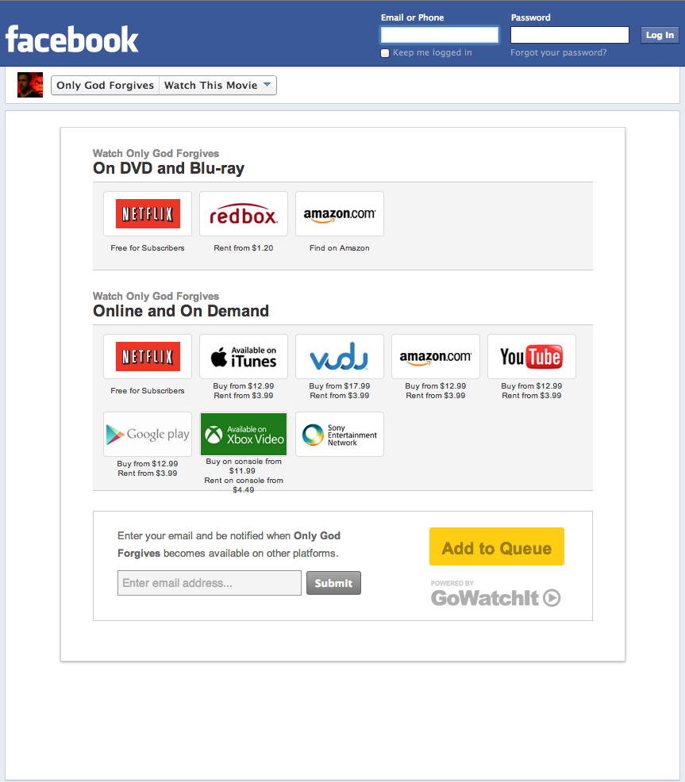

## Welcome to GoWatchIt Project SDK. 
The SDK is a flexible set of tools which allow you to leverage GWI functionality. Mainly: 

* Availability Data
* Queue
* Notificaions 

You can use these components in mobile apps, web-sites, facebook pages, etc. You can use as much or as little of our toolkit as you'd like, all the components are meant to work together, no component necessarily procludes the usage of another. 

Checkout the our website for more info: [GoWatchIt.com](http://gowatchit.com)

### The Widget
This is the quickest way to offer the GWI functionality off the shelf. You can do this with little to no development experience. You can put a GWI button and/or queue botton on any web page, and it can be as simple as pasting a small bit of Javascript into a CMS or blog system. 

By default, when the GWI button is clicked, it displays a lightbox with movie availabilities, as well as queue and quick alerts functinality. You can easily skin/customize the display of the buttons. 

Read the [Widget Documentation](/widget.html) for more info.

### Trailer Widget
Very similar to the basic widget, but it embeds itself directly in the page alongside a trailer. 

Read the [Trailer Widget](/trailerWidget.html) for more info.

### API
We have a RESTFul JSON based API. You can use this API to display movie availabilities, offer quick alert or queue functionality to your users on your mobile app or website. 

Read the [API Documentation](http://docs.gowatchit.apiary.io/) for more info.

### Facebook Page
You can have the GWI Widget show up on your facebook page. It will have availabilities, queue and quick alerts functinality. It is more deeply integrated into facebook, making signup faster for the user.  

Read the [Facebook Page Documentation](/facebook.html).

### Contact
If you have any questions or comments, please [contact](mailto:info@gowatchit.com) us.