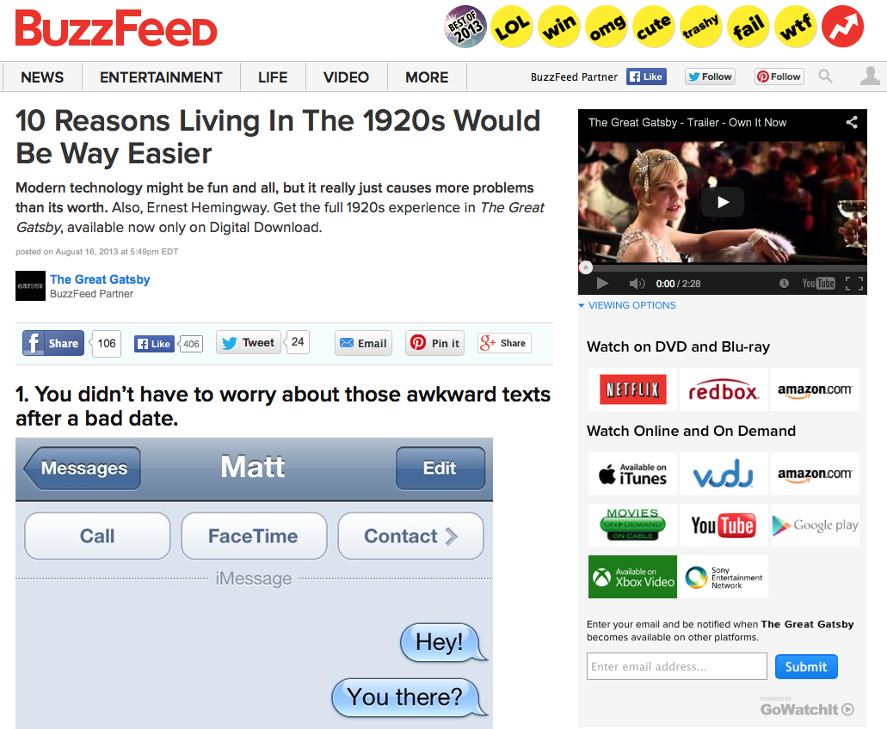

# Trailer Widget
Off the shelf, the widget injects a trailer, availability data, and quick alerts directly into the page. 



## Features:

* Trailer: You can specify any YouTube (or potentially another player platform) video. 

* Availabilities: Users can see which services a movie is currenlty playing on. The availabilities automatically update in real time so you don't have to do it. 

* Quick Alerts: A fast low-barrier way for users to get alerts for new availabilities in the future. Users only need to supply their email address.

* Tracking: We track aggregate status, such as how many users saw a button, vs how many clicked on it. We can also track things like which providers the users clicked on, and even if they purchased something. If users queue a movie, get a notification months later, and purchase that film, we can track the origin of that transaction back to your website. 

* Responsive: The widget will adapt to any screensize/layout. The same code can be used for mobile and desktop web.

## Implementation: 

You include a piece of HTML, a standard Javascript snippet, and some optional programatic parameters. 

First include the following bit of JS after the last gwi-holder div. For best performance include it at the bottom. 
```
<script type="text/javascript">
var gwi = gwi || {};
	gwi.config = { PartnerName: PARTNER_NAME, PartnerId: PARTNER_ID, MovieId: 'GWI_MOVIE_ID', ytid: 'YOUTUBE_TRAILER_ID' };
		(function () {
			var f = document.createElement('script'); f.type = 'text/javascript';
			f.async = true;
			f.src = 'http://gowatchit.com/widget/gwi.js';
			var s = document.getElementsByTagName('script')[0];
			s.parentNode.insertBefore(f, s);
		})();
</script>
```

The following Parameters must be set: 

* PartnerName: The name the GWI uses to account for partner traffic. Your GWI contact will supply this. 
* PartnerID: Your GWI contact will supply thils. 
* MovieId: The GWI MovieID of the movie this widget should display availabilities for. For widescale implementation you can use our API to search for IDs. Otherwise for smallscale implementations, your GWI contact can supply the ID. 
* ytid: The ID for the Youtube trailer. This is an optional parameter. If the default trailer that GWI supplies is not what you want, you can override it with this parameter. 


Next, insert a div(s) into the page body where you want the widget to show up. Use class `gwi-holder`. You can have it as many times on the page as your like, for example, have one in the side rail, and one on the made content column. 

```
    <div class="gwi-holder"></div>
```


 Optionally you can specify some standard sizes. By default the trailer will expand to fill its parent. This is recomended since it will automatically respond to mobile or desktop layouts. If however you want to use specific sizes, include a `data-gwi-unit-size` attribute, one of `large` or `small`. For example: 


 ```
 	<div class="gwi-holder" data-gwi-unit-size="small"></div>
 ```

