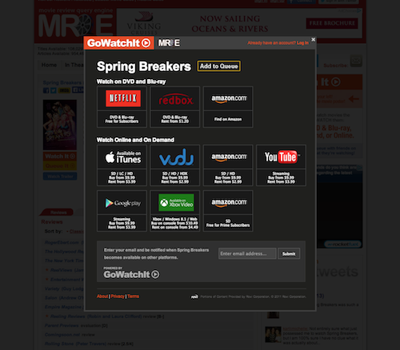

FORMAT: 1A
HOST: http://gowatchit.com

# GWI Widget
Off the shelf, the widget injects the Watch It and Queue It buttons onto the page. Clicking the button popups a lightbox with the features specified below. 


### Features:

* Availabilities: Users can see which services a movie is currently playing on. The availabilities automatically update in real time so you don't have to do it. 

* Quick Alerts: A fast low-barrier way for users to get alerts for new availabilities in the future. Users only need to supply their email address.

* Queue: Users who have a GWI Account (or create one) can add any movie on your site to their universal queue. In addition to getting alerts, users can manage their queue, sort, rate, etc.. 

* Tracking: We track aggregate status, such as how many users saw a button, vs how many clicked on it. We can also track things like which providers the users clicked on, and even if they purchased something. If users queue a movie, get a notification months later, and purchase that film, we can track the origin of that transaction back to your website. 




### Buttons
The Watch It button will launch the lightbox. The Queue button--if a user is logged into GWI--will automatically add the movie to a user's queue without displaying the lightbox. If the user is not logged in, the Queue It button will also launch the lightbox. 

### Customization

You can customize the colors and orientation of the buttons. You can also elect to show only the Queue button, or both. One popular implementation is to use our API to display availabilities directly on the page, and include the Queue It button only for users who wish to queue the movie. 


## Technical overview
There are two components required to get a widget on the page. There is a small, lightweight Javascript include which uses only plain vanilla JS (no libraries or frameworks), which must be included somewhere on the page (we recommend pasting the include towards the bottom of the page, if possible, to improve page load performance). The Javascript is hosted on the Amazon Cloudfront content delivery network, to increase speed and reliability.  

Secondly, you must identify the movie to the widget. If you are using the widget on an ad hoc basis, aka only for a handful of movies, we can provide "embed" links, similar to how a YouTube video embed code works. For larger scale implementations, where a widget will appear on many individual pages, you can pass the ID of the movie programmatically. We recognize certain industry standard IDs such as the Rovi/AMG ID. 

## Pasting individual embedded widgets. 
GoWatchIt staff will supply you with specific links to paste into the *source* of your web page. These are designed to require little or no programming experience. You should paste the links EXACTLY where you want them to appear on the page. You can paste one or as many buttons for as many different movies as you require.

The Javascript embed code will look something like this:

```
    <script type="text/javascript" language="javascript" 
        src="http://widget.gowatchit.com/embed.js?key=bW92aWUtMjY1ODc0LTk=&version=2">
    </script>
```

### Customizing the layout. 
By default the widget will have an orange "Watch It" button on top of a yellow "Queue It" button, as seen here:


#### Horizontal Layout
If you add `&horizontal` to the end of the Javascript URL, you will get a side-by-side version of the widget:


```
    <script type="text/javascript" language="javascript" 
        src="http://widget.gowatchit.com/embed.js?key=bW92aWUtMjY1ODc0LTk=&version=2&horizontal">
    </script>
```

#### Custom Image Themes

You can supply your own CSS to replace the images used in the buttons, which are actually just background CSS images. (We can supply you with the original PSD to base your own images off of). There are three button images: Watch It, Queue It, and In Queue. The first two should have a "hover" state image as well, to indicate clickability.

 

Using the below CSS as a template you can replace the default button image with your own. For example: 


```
    .watchit_container .watchit_button {
        background-image: url('/images/watchit_buttons/watch.jpg'); 
    }
    .watchit_container .watchit_button:hover {
        background-image: url('/images/watchit_buttons/watch_hover.jpg'); 
    }
    .watchit_container .watchit_queue_button.not_in_queue { 
        background-image: url('/images/WatchIt_buttons/queue.jpg'); 
    }
    .watchit_container .watchit_queue_button.not_in_queue:hover { 
        background-image: url('/images/watchit_buttons/queue_hover.jpg'); 
    }
    .watchit_container .watchit_queue_button.in_queue {
        background-image: url('/images/watchit_buttons/queue_active.jpg');
    }
    .watchit_container .watchit_queue_button.in_queue:hover { 
        background-image: url('/images/watchit_buttons/queue_active.jpg');
    }
```


## Using standard Javascript include and ID

This method is more powerful than pasting embedded links. You can, for example, deploy this in one template of a CMS and have a button appear in the same place for different movies on different pages. 

You include a piece of HTML, a standard Javascript snippet, and programmatically pass the ID of the movie to the widget. 

First, paste the following on the page source where you want the button to appear:

```
    <div id="watchit">
    </div>
```

Next, you will place a small amount of JavaScript, preferably at the bottom of the page (after your content). Placing it at the bottom of the page ensures faster loading times.

Where you see the term "PARTNER", replace that with your organization's short name which we will provide you with. (all lowercase, no spaces, dashes between words.)

```
    <script type="text/javascript" language="javascript">
        var watchit_target_id = 'watchit'; /* required for bottom-of-page usage */ 
        var watchit_version = 2;
        var watchit_ID = "38691";
    </script>
    <script type="text/javascript" language="javascript" 
        src="//cdn.gowatchit.com/watchit/PARTNER.js"> 
    </script>
```
### Optional Variables. 
You can add more variables within the first `<script>` block above. 

* `var watchit_target_id= 'some_string'` : The id of the div containing the widget. 
* `var watchit_horizontal = true;` : Places the widget buttons side-by-side.

If you are programatically supplying a movie id, one of the following is required:

* `var watchit_id=9999;` : Load the widget with a specific GoWatchIt movie_id. This is typically used in concert with the API to determine the ID. 
* `var watchit_AMG_ID=9999;` Loads the widget using a Rovi/AMG id. 

You can apply custom CSS to the widget exactly the same as specified above. 
